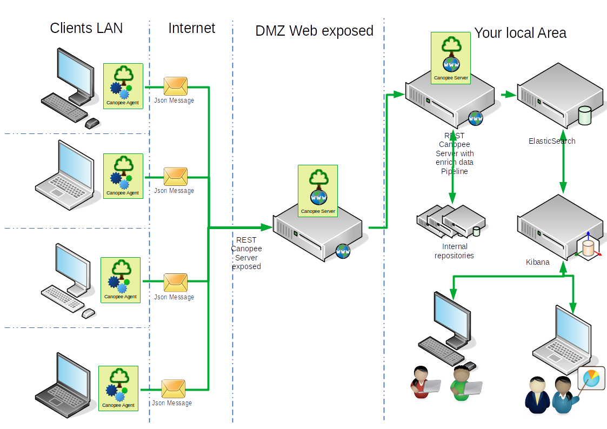
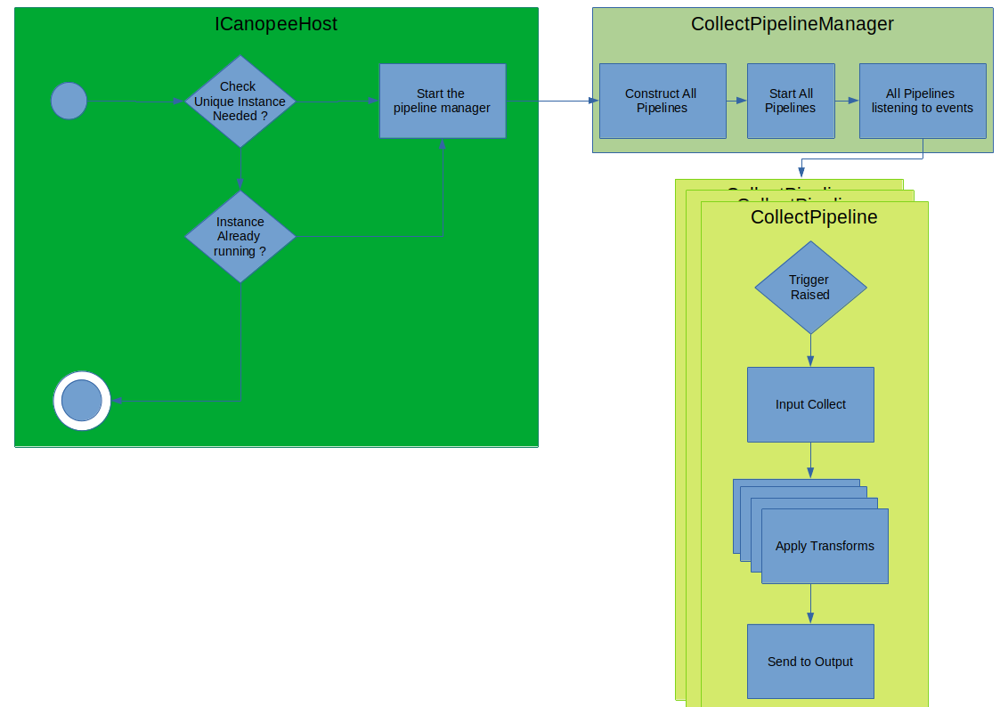

# Canopee Applications

## Introduction

The Canopee Applications is a simple, configurable, composable telemetry tool to collect, transform and push datas to any datalake you want.

It has been initially designed to collect local info on workstations and push them to Elastic Search, but can be extended to any collect, transform and output you want !

It contains two components : 

- The Agent : responsible for collecting event on a local workstation or server and send them to the output, that can be CanopeeServer for further data transformations, or directly your datalake.
> There is two implementations of agent : the console agent, which is more for demo and test purpose, and the electron agent which is more for production. The difference between both agent are the host process.
- The Server : expose a pipeline engine through REST and help you ingest and transform collected datas from agent with datas that are not available on agents. Used also to centralize configurations of agents by group or agentid (Experimental features for now).

## Prerequiresite

The Canopee Applications are dotnet core 3.1 standalone applications. Today implementations has been tested on windows and linux environment. 

## Installation 

> Work In Progress

## General 

### General purpose of the Canopee Engine : 

Below the general scheme of the Canopee engine : 


**<u>NB :</u>** not all inputs, transforms and outputs in the above schema are currently implemented. Please see reference for today available implementation.

Doesn't find the input, transform or output you need ? You can easily extend the available library of component by creating your own plugin assembly !

### Architecture

 Below a global scheme of a standard Canopee architecture : 
 


 As you can see, agents will collect data locally on client workstations, send them through REST call to a Canopee Server Node, that will enrich data through specific pipelines, and then store data to an ElasticSearch server. Operationals can then consult data through a Kibana server, using reports designed specifically for them.
 
 ### Objects Relationships
 
 Below a schema that describes relations between each type of object in Canopee Framework :
 
 
as  
 ### How does it works ? 
 
 How does it works ? Below a schema of the pipeline process that describes the way a pipeline is working : 
 
  

To sumup : 

When the host start, it checks if there is already another agent that is running. If not, it creates a pipeline manager that will read the configuration and create all configured pipelines and start it.

Each pipeline is composed of :

- _A trigger :_ this component will trigger the collect of event (an event is a set of data and a timestamp). This can be a cron expression, a once trigger with a duetime or an external call (as it is used in the REST exposition of the Canopee Server)
- _An input :_ this component is responsible for collecting the original event from a batch output, or any other implementation you want
- _Multiple transformers :_ each transformers is responsible for 
    - extracting new fields from original event **AND/OR**
    - changing the type of the transformed collected event **AND/OR**
    - make any transfomation on any field of the original collected event (removing, changing type, etc ...)
- _An output :_ this will send a Json string to any output configured (directly to a data store or sending it to a Canopee server instance in order to make other transformation, for example to enrich the collected event with an internal repository that is not accessible from the agent)  

If an external command to stop is send to the host, the host will stop and dispose the PipelineManager, that will stop and dispose any pipeline.

### Extensibility of the system and Composition

As explain before, Canopee Applications and framework is a extensible, composable system. It means that without changing a line in the Canopee Framework, you have the ability to extends easily the list of trigger, input, transforms and output available, add new pipelines, modify existing pipelines.

As said, you have two kind of operations :

- changing the list of pipelines to be executed
- extending the catalog of components to used in any pipelines

#### Adding/Modifying pipelines

This operation will be done in the configuration object (NB: the configuration will be explained in detailed in another documentation, see [Resources](#resources))

here is a sample of the configuration file : 

``` json

{
    "Canopee": {
        "AgentId": "D42651C1-9DF0-4117-A3AF-3FFAFB5DB8DB",
        "UniqueInstance": false,
        "Configuration": {
            "IsSync": true,
            "SynchronizerType":"Default",
            "NoSSLCheck": true,
            "url": "http://localhost:5000",
            "DueTimeInMs": "3000",
            "PeriodInMs": "30000"
        },
        "Logging": {
          "LoggerType": "MultiLogger",
          "Loggers": [
            {
              "LoggerType": "Console"
            },
            {
              "LoggerType": "Log4Net"
            },
            {
              "LoggerType": "Electron"
            }
          ]
        },
        "Db": {
          "Url": "http://localhost:9200"
        },
        "Trigger": {
          "TriggerType": "HubTrigger",
          "DefaultPipelineId" : "C7F1ADD9-D5B7-40AA-8A50-7E786F1513E8" 
        },
        "Pipelines": [
          {
            "Name": "Hardware",
            "Type": "Default",
            "Trigger": {
              "TriggerType": "Once",
              "DueTimeInMs": 2000
            },
            "Input": {
              "InputType": "Hardware",
              "OSSpecific": true
            },
            "Transforms": [
              {
                "TransformType": "FirebirdInsert",
                "ConnectionString": "User=MyUser;Password=MyPassword;Database=firebirddb.fdb;DataSource=localhost;Port=3050;Dialect=3;Charset=NONE;Role=;Connection lifetime=15;Pooling=true;MinPoolSize=0;MaxPoolSize=50;Packet Size=8192;ServerType=0;",
                "SelectStatement": "SELECT * FROM userinfos",
                "Fields": [
                  {
                    "LocalName": "RPPS",
                    "SearchedName": "RPPS"
                  },
                  {
                    "LocalName": "SAPID",
                    "SearchedName": "SAPID"
                  }
                ]
              }
            ],
            "Output": {
              "OutputType": "Console"
            }
          },
          {
            "Name": "Products",
            "Type": "Default",
           "Trigger": {
              "TriggerType": "Cron",
              "When": "0 0/5 * * * ?"
            },
            "Input": {
              "InputType": "FireBirdADO",
              "ConnectionString": "database=localhost:firebirddb.fdb;user=MyUser;password=MyPassword;Pooling=true",
              "SelectStatement": "SELECT * FROM versions"
            },
            "Transforms": [
              {
                "TransformType": "FirebirdInsert",
                "ConnectionString": "database=localhost:firebirddb.fdb;user=MyUser;password=MyPassword;Pooling=true",
                "SelectStatement": "SELECT * FROM userinfos",
                "Fields": [
                  {
                    "LocalName": "RPPS",
                    "SearchedName": "RPPS"
                  },
                  {
                    "LocalName": "SAPID",
                    "SearchedName": "SAPID"
                  }
                ]
              },
              {
                "TransformType": "OperatingSystem",
                "OSSpecific": "true"
              },
              {
                "TransformType": "Hardware",
                "OSSpecific": "true"
              }
            ],
            "Output": {
              "OutputType": "Console"
            }
          }
        ]
    }
}

```  

A quick explanation of the configuration : 
All Canopee configuration are read from the "Canopee" section of a classic appsettings.json configuration file. It is composed of :
- AgentId : mandatory, if not set at the first start it will filled by application. Must be unique and standard value is a uuidv4 
- UniqueInstance : optional, give ability to deactivate the check for another instance
- Configuration : optional, this section configured the way the ConfigurationService works, for example the sync process from centralized source (Experimental feature). It will be detailed in [Resources](#resources)
- Logging : optional, by default log to console output, this section specify the logger configuration
- Db : optional and specific to Server instance, used for the DbContext used in AspNet Core implementation
- Trigger : optional and specific to Server instance, used for starting pipeline from a REST call and a trigger raised by the Controller 
- Pipelines : this defines the pipelines:
    - Name : optional
    - Id : optional, standard is a uuidv4
    - Type : optional, allow the possibility to implements your own types of pipeline
    - Trigger : define the trigger related to the current pipeline. Only TriggerType is common to all kind of trigger. Other fields are implementation specific
    - Input : define the input that will collect event. The only common field for this section will be InputType, that define the type of input, rest of fields will be specific to the input implementation
    - Transforms : define a collection of Transform object. Same as Input, only TransformType field is common, other fields are implementation specific
    - Output : define the Output object. Same as Input, only OutputType field is common, other fields are implementation specific  

When defining each component of a pipeline, you have a [ComponentName]Type field that define the implementation to be used in the pipeline. This done using Factory pattern, each component factory using [MEF](https://docs.microsoft.com/fr-fr/dotnet/framework/mef/).

That means that for each implementation, you will had a declarative attribute that map the operation contract implemented and the unique name of the implementation type.

Here some examples :

- for ICanopeeLogger
``` csharp

    [Export("Console", typeof(ICanopeeLogger))]
    [Export("Default", typeof(ICanopeeLogger))]
    public class ConsoleCanopeeLogger : BaseCanopeeLogger
    {
        ...
    }

 ```  
- for ITrigger 

``` csharp
    [Export("HubTrigger", typeof(ITrigger))]
    [Export("Default", typeof(ITrigger))]
    [Shared]
    public class HubTrigger : BaseTrigger
    {
        ...
    }
```
- for IInput

``` csharp

    [Export("CSV", typeof(IInput))]
    public class CSVInput : BaseInput
    {
        ...
    }

```

- for ITransforms

``` csharp

    [Export("ElasticVLookup", typeof(ITransform))]
    public class ElasticLookupTransform : BaseTransform
    {
        ...
    }

```

- for IOutput

``` csharp

namespace Canopee.StandardLibrary.Outputs
{
    [Export("Console", typeof(IOutput))]
    [Export("Default", typeof(IOutput))]
    public class ConsoleOutput : BaseOutput
    {
        ...
    }

```

The standard catalog of implementations is contained in the Canopee.StandardLibrary stored in the Pipelines subdirectory of the executable running.

#### Extending Component catalogs 

To add a new logger/trigger/input/transform/output, you just have to :
- create your own assembly referencing Canopee.Common and optionally Canopee.Core (if you want to benefit the Base[Component] implementation)
- add Microsoft.Composition nuget package
- add a class that implements the corresponding operations contract (or inherits from Base[Component] class)
- implements your class and add an Export attribute  

And finally just put your assembly and all its dependencies in the subdirectory Pipeline. When restarting the agent or server, the new assembly will be directory added to the catalog of the available component, and if configured in the pipeline configuration, the component will be instanciated !

## Resources

- [Api References](docs/References/ReferencesHome.md) 
- Tutorials : **<span style="color=orange"> (Work in Progress) </span>**
    - Add a ICanopeeLogger type **<span style="color=orange"> (Work in Progress) </span>**
    - Add a ITrigger type **<span style="color=orange"> (Work in Progress) </span>**
    - Add a IInput type **<span style="color=orange"> (Work in Progress) </span>**
    - Add a ITransform type **<span style="color=orange"> (Work in Progress) </span>**
    - Add a IOuput type **<span style="color=orange"> (Work in Progress) </span>**
- Configuration documentation **<span style="color=orange"> (Work in Progress) </span>**
- Configuration Synchronization **<span style="color=orange"> (Work in Progress) </span>**